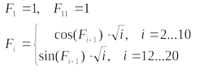
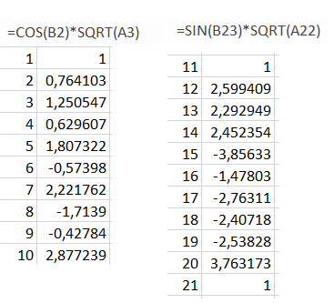

<p align="center"><b>МОНУ НТУУ КПІ ім. Ігоря Сікорського ФПМ СПІСКС</b></p>
<p align="center">
<b>Звіт з Розрахунково-графічної роботи</b><br/>
дисципліни "Вступ до функціонального програмування"
</p>

<p align="right"><b>Студент</b>: Скібчик Арсен група КВ-21</p>
<p align="right"><b>Рік</b>: 2026</p>

## Загальне завдання
1. Реалізувати програму для обчислення функції згідно варіанту мовою Common Lisp. 
2. Виконати тестування реалізованої програми.
3. Порівняти результати роботи програми мовою Common Lisp с розрахунками 
іншими засобами
## Варіант <1(17)>
<p align="left">  </p>


## Лістинг реалізації завдання
```lisp
(defparameter *f1* 1.0)   ;  умова для першої гілки 
(defparameter *f11* 1.0)  ;  умова для другої гілки 
(defparameter *f21-default* 1.0) ; Припущене значення для i=21

;; Реалізація функції обчислення 
(defun calculate-f (i)
  (cond
    ((= i 1) *f1*)
    ((= i 11) *f11*)
    
    ;; гілка i = 2 - 10 
    ((and (>= i 2) (<= i 10))
     (let ((prev-f (calculate-f (1- i))))
       (* (cos prev-f) (sqrt i))))
    
    ;; гілка i = 12 - 20  
    ((and (>= i 12) (<= i 20))
     (let ((next-f (if (= i 20) 
                       *f21-default* (calculate-f (1+ i)))))
       (* (sin next-f) (sqrt i))))
    
    (t (error "Index outside the specified ranges (1..10 or 11..20).")))) 
```
### Тестові набори та утиліти 
```lisp
(defun tests ()
  (format t "~%~7A | ~15A" "i" "F_i")
  (format t "~%--------------------------")

  (format t "~%Range 1 (i=1..10):")
  (loop for i from 1 to 10 do
        (format t "~%~7D | ~15,6F" i (calculate-f i)))
  
  (format t "~%~%Range 2 (i=11..20):")
  (loop for i from 11 to 20 do
        (format t "~%~7D | ~15,6F" i (calculate-f i)))
  (format t "~%--------------------------")) 

```
### Тестування
```lisp
CL-USER> (tests)

i       | F_i            
--------------------------
Range 1 (i=1..10):
      1 |        1.000000
      2 |        0.764103
      3 |        1.250547
      4 |        0.629607
      5 |        1.807322
      6 |       -0.573979
      7 |        2.221761
      8 |       -1.713898
      9 |       -0.427841
     10 |        2.877241

Range 2 (i=11..20):
     11 |        1.000000
     12 |        2.599437
     13 |        2.292937
     14 |        2.452359
     15 |       -3.856332
     16 |       -1.478032
     17 |       -2.763113
     18 |       -2.407177
     19 |       -2.538275
     20 |        3.763173
--------------------------
NIL
```
### Порівняння результатів з обчисленням іншими програмними засобами 
Для порівннянь результатів було використано табличний ПЗ Microsoft Excel. Обчислення проводилось з використанням вбудованих функцій COS(), SIN() та SQRT(). При обчисленні другої гілки через відсутність граничного значення у завданні було прийнято припущене значення F(21) = 1. Порівняння результатів показало збіг значень, що свідчить про правильність реалізованого алгоритму
<p align="left">  </p>
